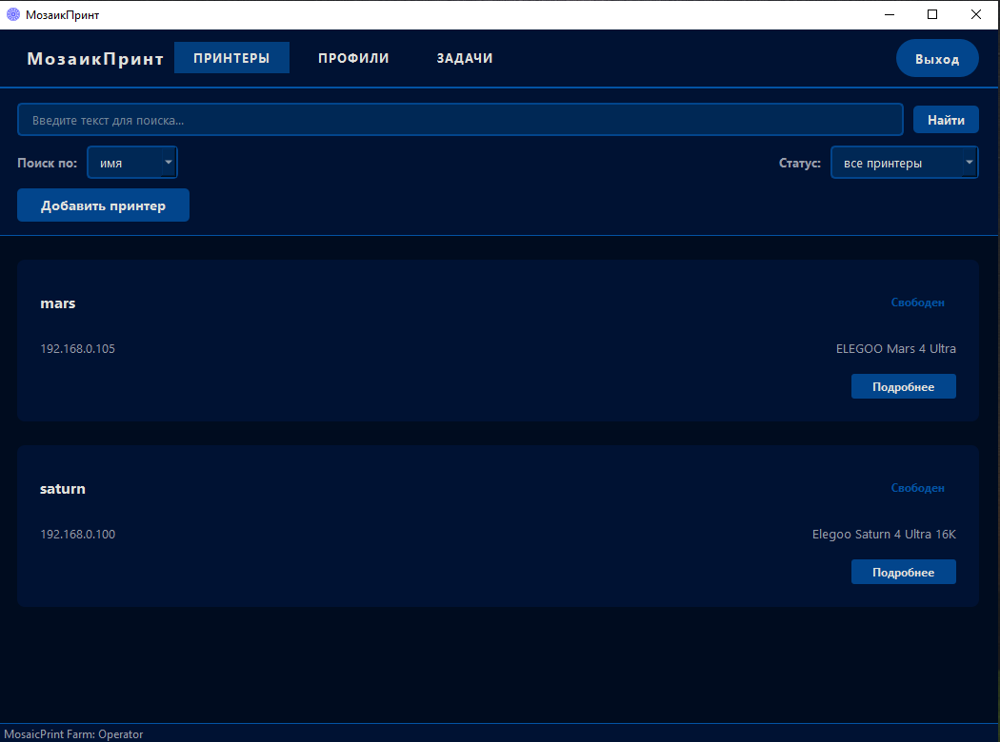
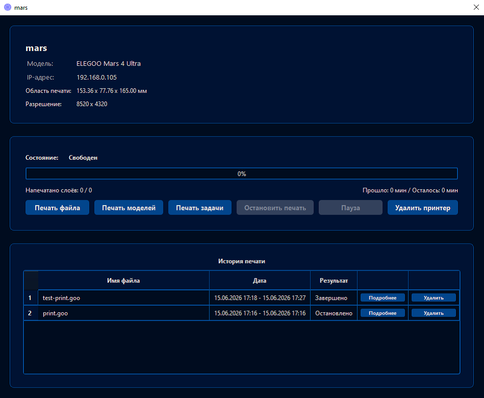
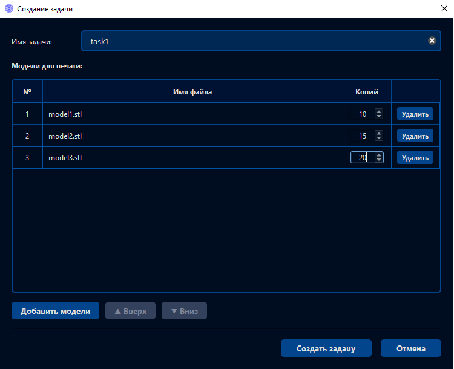
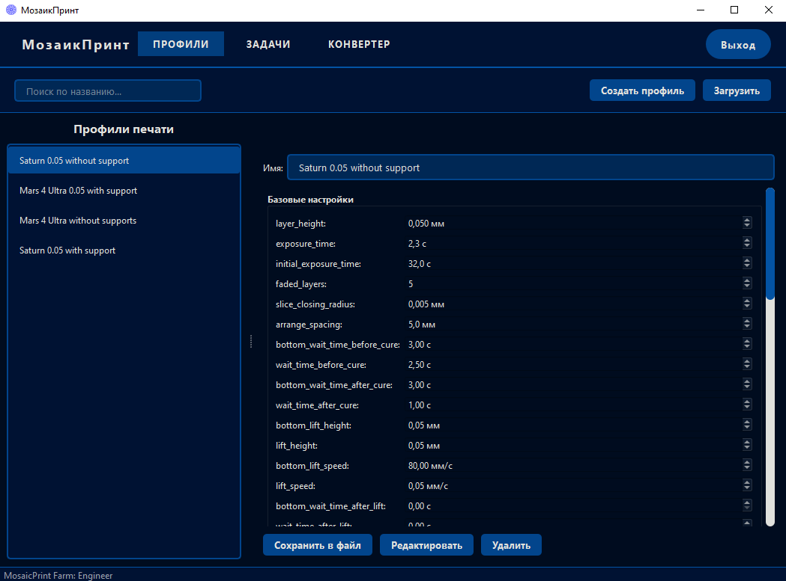
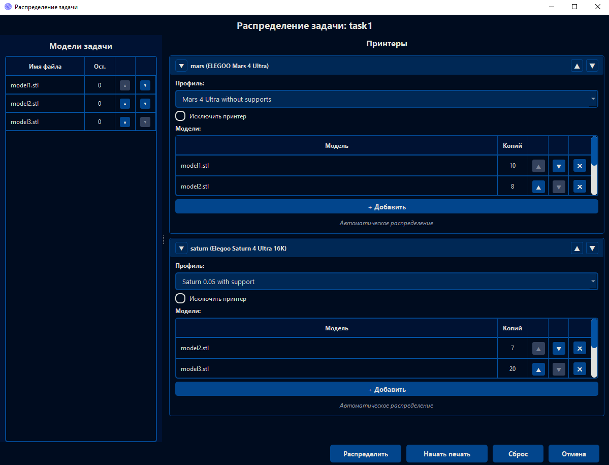
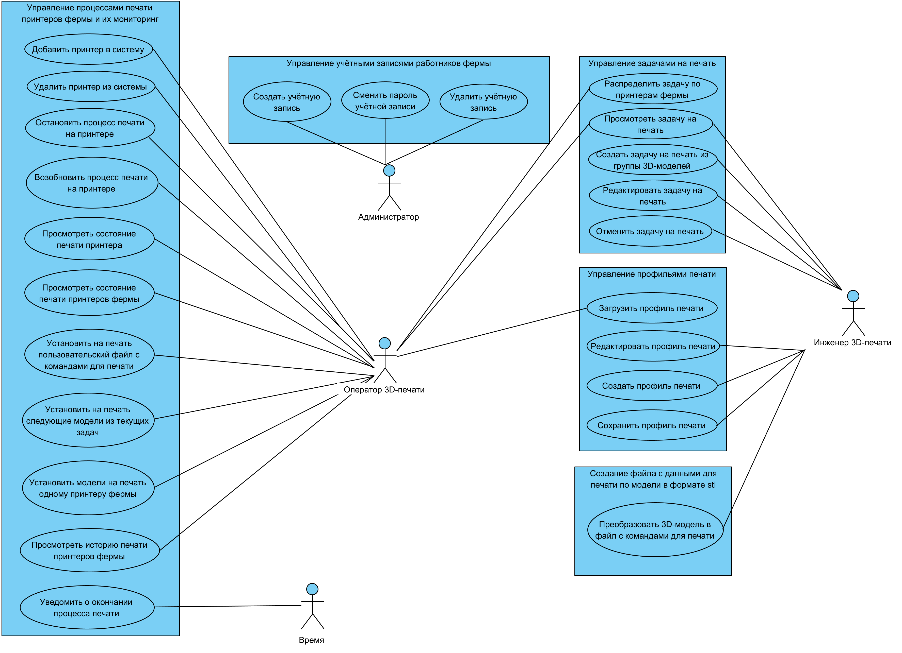

# MosaicPrint — Информационная система централизованного управления фермой 3D-принтеров
MosaicPrint — это десктопное приложение на C++/Qt6 для управления фермой фотополимерных 3D-принтеров.  
Система позволяет оператору удалённо контролировать все устройства, автоматически распределять задачи печати и мониторить процесс в реальном времени.

## О проекте

MosaicPrint — это десктопная информационная система, предназначенная для централизованного управления фермой фотополимерных 3D-принтеров. Она обеспечивает дистанционное управление группой устройств и автоматизацию распределения 3D-моделей по принтерам.

### Возможности системы

Система реализует следующий набор функциональных возможностей:

- **Управление профилями печати** — создание, редактирование, импорт/экспорт, сохранение и удаление профилей печати.
- **Управление задачами на печать** — создание задач из группы 3D-моделей, просмотр, редактирование, отмена, сохранение и экспорт задач, а также автоматическое или ручное распределение оставшихся моделей активной задачи по свободным принтерам фермы.
- **Создание файла с командами для печати** — преобразование 3D-модели в файл с командами для печати на принтере определённой модели.
- **Управление процессами печати** — удалённый запуск печати пользовательских файлов с командами, 3D-моделей с использованием профилей печати, а также следующих моделей из текущих задач.
- **Мониторинг состояния принтеров** — просмотр текущего статуса печати принтеров фермы, количества напечатанных и оставшихся слоёв, прошедшего и оставшегося времени, а также истории печати.
- **Уведомления о завершении печати** — автоматическое оповещение при завершении процесса печати на любом принтере фермы.

## Демонстрация

### Окно мониторинга состояния принтеров фермы

В данном окне отображается список всех принтеров фермы с их текущим статусом, IP-адресом и прогрессом печати. Доступны поиск по имени, модели или IP-адресу, фильтрация по статусу.

---

### Окно принтера

Окно предоставляет детальную информацию о технических параметрах, статусе и историю выполненных печатей конкретного принтера. Здесь можно запустить печать на устройстве или приостановить/возобновить изготовление.

---

### Окно создания задачи на печать

Окно позволяет создать новую задачу, включающую в себя группу 3D-моделей, которые необходимо изготовить на ферме. Для этого в систему добавляются пути к моделям и указываются количество копий и порядок печати.

---

### Окно профилей печати

Окно используется для управления параметрами печати. В нём можно просмотреть список профилей, создать/загрузить новый или отредактировать имеющийся.
	
---

### Окно распределения задачи по принтерам фермы

Окно позволяет распределить модели текущей задачи по свободным принтерам. Предусмотрено ручное закрепление моделей за конкретным принтером, исключение принтеров из распределения, выбор профиля печати для каждого устройства и автоматическое размещение моделей на платформе. После завершения распределения можно запустить слайсинг и отправить файлы на печать.

---

### Видео-демонстрация

https://github.com/user-attachments/assets/158f7963-b255-4be2-8734-b3fc563ffd23

[*видео в высоком качестве](demo/videos/MosaicPrint-Demo-HighQuility.mp4)

## Пользователи системы

Система предусматривает работу с четырьмя ролями пользователей:

### Администратор фермы
- Управление учётными записями работников фермы в системе (создание, изменение пароля, удаление).

### Инженер 3D-печати
- Создание и редактирование профилей печати.
- Создание и редактирование задач на печать.
- Конвертация файлов в формате STL в файлы с командами для печати на принтере определённых моделей.

### Оператор 3D-печати
- Управление процессами печати, включающее в себя:
  - Запуск печати пользовательских файлов с командами для печати.
  - Запуск печати 3D-моделей в формате STL с использованием выбранных профилей печати.
  - Запуск печати следующих моделей из текущих задач.
  - Остановку и возобновление процесса печати на принтере.
- Мониторинг процесса печати 3D-принтеров фермы.
- Просмотр истории печати устройств.

## Диаграмма вариантов использования

Диаграмма отражает функциональные возможности системы и их связь с ролями пользователей.

## Технологический стек

- **Язык программирования:** C++17
- **Графический интерфейс:** Qt6
- **Система сборки проекта:** CMake
- **Менеджер зависимостей:** vcpkg
- **Компилятор:** MSVC

### Работа с сетью

Обмен информацией с устройствами организован по протоколу SDCP (Smart Device Control Protocol), разработанному компанией CBD-Tech для фотополимерных принтеров и опубликованному в июне 2024 года под лицензией MIT. Протокол обеспечивает полный цикл управления: получение телеметрии о состоянии устройства, передачу файлов по сети и дистанционное управление печатью.
Система поддерживает два поколения протокола. Версия 1.0  использует MQTT для обмена командами и статусами: устройство подписывается на топики вида /sdcp/request/<MainboardID> и публикует ответы в /sdcp/status/<MainboardID>. Версия 3.0 работает поверх WebSocket, устанавливая постоянное соединение с устройством на порт 3030. Обнаружение принтеров в обоих случаях выполняется UDP-дейтаграммой на порт 3000, в ответ на которую устройство сообщает свой идентификатор, IP-адрес и версию протокола.
Для передачи файлов используется HTTP-протокол. Для версии SDCP 1.0 система разворачивает HTTP-сервер, а для SDCP 3.0 система выполняет роль клиента, который подключается к развёрнутому на принтере серверу.

- **Реализация UDP:** Boost.Asio
- **Реализация WebSocket:** Boost.Beast
- **Клиентская библиотека для MQTT:** Eclipse Paho MQTT C++
- **Встроенный MQTT-брокер:** Eclipse Mosquitto
- **Реализация HTTP:** cpp-httplib

### Хранение и безопасность данных

- **Встраиваемая реляционная СУБД:** SQLite
- **Расширение SQLite для шифрования:** SQLCipher
- **ORM для работы с SQLite:** sqlite-orm
- **Криптографическая библиотека:** OpenSSL
- **Библиотека для проверки JWT-токенов лицензий:** jwt-cpp

### Парсинг и логирование

- **Работа с JSON:** RapidJSON
- **Логирование:** spdlog

## Контакты
Email: yatsenko1147@gmail.com

## Лицензия

Демонстрационные материалы проекта (скриншоты, видео, диаграммы, текстовое описание) распространяются под лицензией **Creative Commons Attribution-NonCommercial-NoDerivatives 4.0 International (CC BY-NC-ND 4.0)**

**Авторские права:** © 2026 Yatsenko-Egor

Полный текст лицензии: [LICENSE](./LICENSE)
